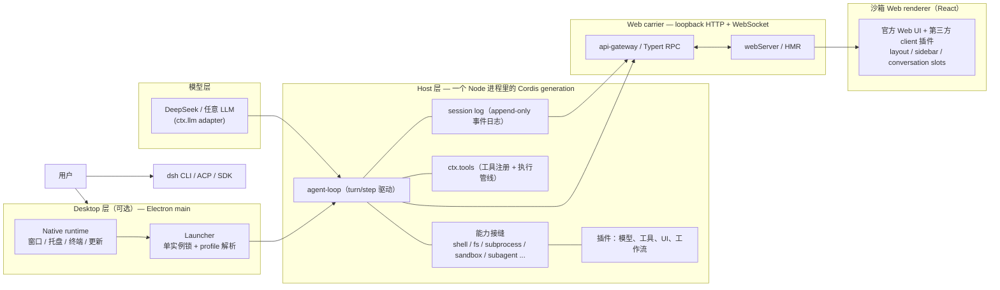
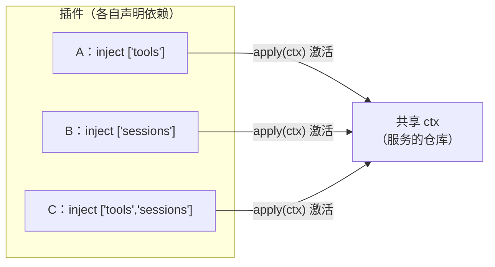
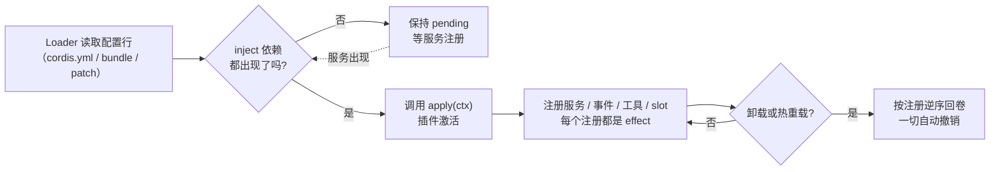
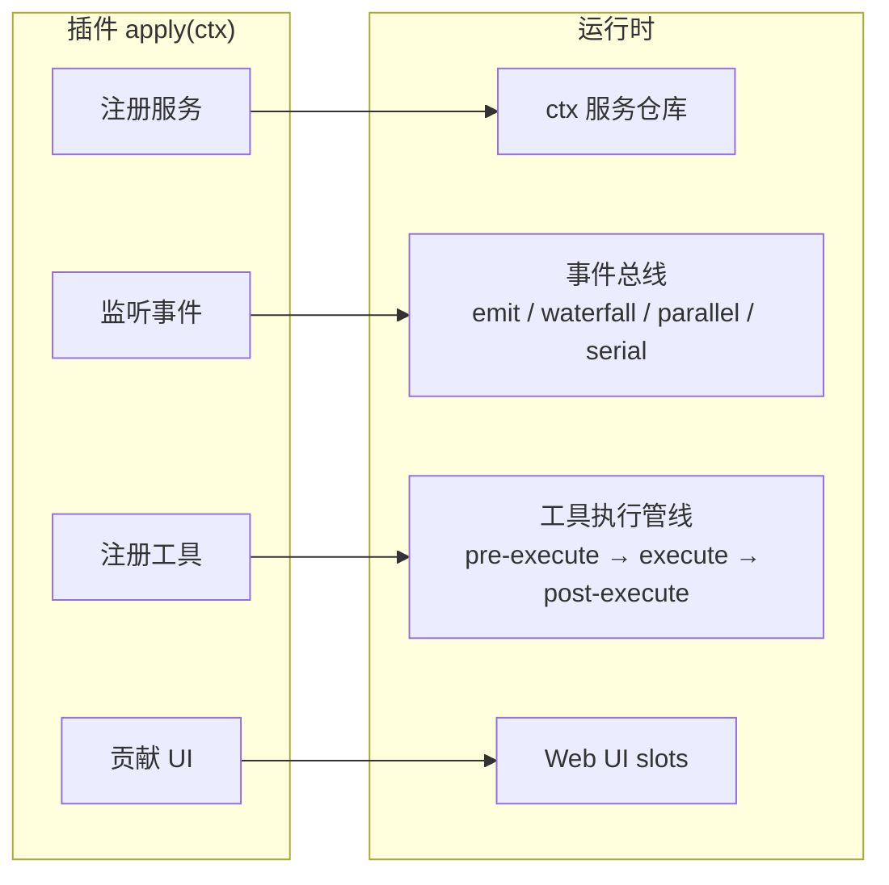
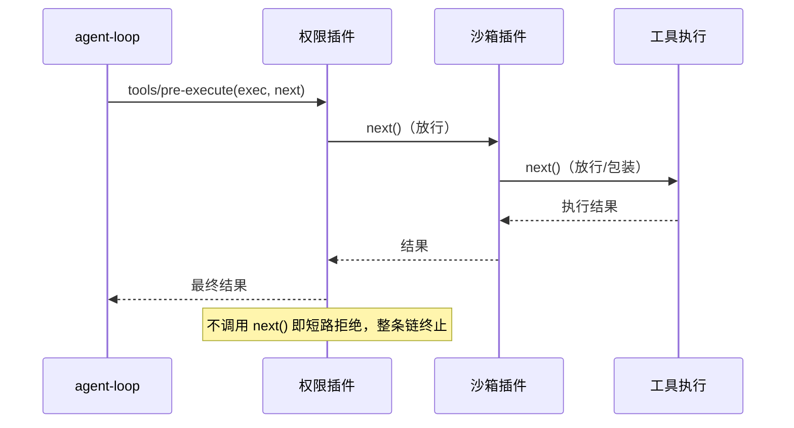
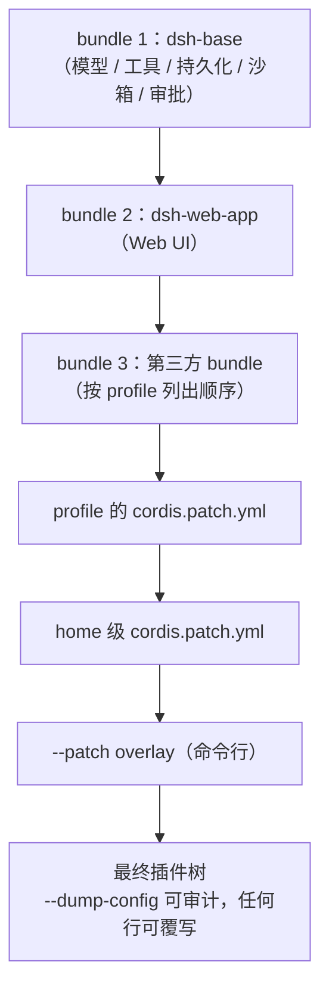
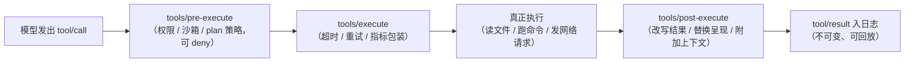
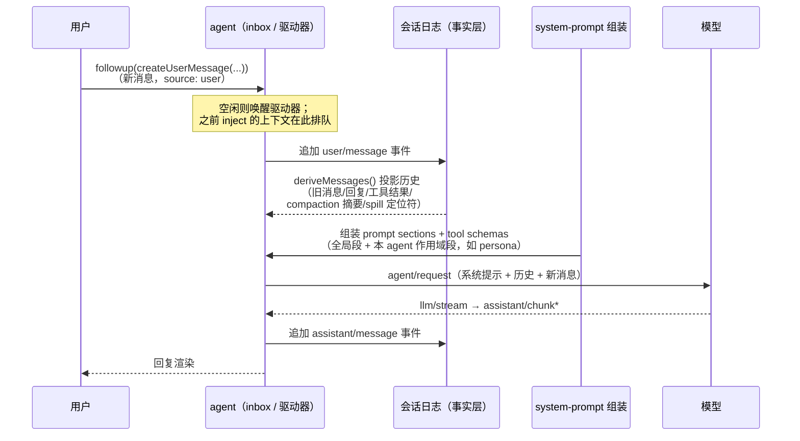

# DSH（DeepSeek Harness）实现分享

> 一个"一切皆插件"的开源 Agent Harness：从核心运行时到桌面应用
>
> 本文基于本仓库 `deepseek-harness-desktop`（DSH Desktop，固定上游 DeepSeek Harness 0.1.0-rc.7）的实现整理，先讲整体架构，再分章节展开，最后与 Claude Code 做对比。

---

## 目录

- [0. 这是什么](#0-这是什么)
- [1. 整体架构：先看全景](#1-整体架构先看全景)
- [2. 插件基座：Cordis 与"一切皆插件"](#2-插件基座cordis-与一切皆插件)
- [3. 组合与分发：Profile、Bundle、Patch](#3-组合与分发profilebundlepatch)
- [4. 核心运行时：会话日志、Agent 循环、工具](#4-核心运行时会话日志agent-循环工具)
- [5. 记忆：日志不是记忆，投影才是](#5-记忆日志不是记忆投影才是)
- [6. 事件体系：系统的扩展点](#6-事件体系系统的扩展点)
- [7. 能力接缝：可整体替换的能力](#7-能力接缝可整体替换的能力)
- [8. Web Client：loopback 载体与前端插件](#8-web-clientloopback-载体与前端插件)
- [9. DSH Desktop：薄的 Electron 宿主](#9-dsh-desktop薄的-electron-宿主)
- [10. 桌面自研功能：主会话、消息通道、任务视图](#10-桌面自研功能主会话消息通道任务视图)
- [11. 插件市场与生态](#11-插件市场与生态)
- [12. 打包、沙箱与安全](#12-打包沙箱与安全)
- [13. 自动化与 SDK](#13-自动化与-sdk)
- [14. 与 Claude Code 的对比](#14-与-claude-code-的对比)
- [15. 结语：我从这个实现里学到什么](#15-结语我从这个实现里学到什么)

---

## 0. 这是什么

**DeepSeek Harness（dsh）** 是深度求索开源的 Agent Harness（MIT 协议），核心哲学一句话：

> **一切皆插件**——模型适配、工具注册、会话日志、甚至是 Agent 循环本身，都是插件。整台机器由配置组合出来，没有不可替换的"特权核心"。

它建立在 **Cordis**（Koishi 生态的插件框架，本仓库以 `vendor/` 方式固定 vendoring）之上。Cordis 的设计哲学来自论文《A Programming Paradigm for Spatiotemporal Composability》。

**DSH Desktop** 是社区围绕 Harness 做的开源桌面客户端（Electron）：把"需要装 Node、配 profile、跑命令行"的 Harness，变成一个"下载即用"的 Windows/macOS 应用。它有一个关键坚持——**Desktop 本身也是一个插件**，不修改上游一行源码。

本分享覆盖三层：


| 层   | 内容                                                         | 仓库位置                                            |
| --- | ---------------------------------------------------------- | ----------------------------------------------- |
| 核心  | 上游 DeepSeek Harness（plugin tree、agent loop、session、Web UI） | `deepseek-harness/`（固定版本子模块）                    |
| 桌面  | Electron 薄宿主 + 桌面插件（shell、profiles、terminal、updates…）      | `dsh-plugin-desktop/`                           |
| 生态  | 社区插件市场、社区互操作 RFC                                           | `dsh-community-market/`、`dsh-community-fabric/` |


---

## 1. 整体架构：先看全景

### 1.1 一张图看懂




### 1.2 三个设计支柱

1. **一切皆插件（Cordis）**：插件向共享 `ctx` 贡献 service、typed events 和可逆 effect；注册即效果，卸载即回卷。连 agent loop 都是可替换的插件。
2. **会话日志是唯一事实源**：任何进入模型请求的东西都必须能从事务日志重建（"model-visible ⟺ logged"）。Fork、resume、回放、UI 渲染全部从这条 append-only 日志派生。
3. **能力接缝可整体替换**：每个能力是"Service Definition（接口）+ Provider（实现）+ Consumer（消费方，通常是工具）"三位一体。换一个 Provider，整个产品跟着换（比如把本地 shell 换成远程沙箱）。

### 1.3 分层视角

从下往上：

- **模型层**：通过 `ctx.llm` 适配器接入，默认 DeepSeek，可换成任何实现同一接缝的模型。
- **Host 层**：一个 Node 进程里由 Cordis Loader 组装出的插件树（叫 **generation**）。agent loop、session log、tools、所有能力接缝都在这里。
- **Carrier 层**：Host 通过 loopback HTTP + WebSocket 把能力暴露给 UI。RPC 由 api-gateway（Typert 类型图驱动的远程网关）负责。
- **Renderer 层**：沙箱化的 Web 页面（React），只通过 loopback carrier 通信，**没有 Node 能力**。
- **Desktop 层**（可选）：Electron main 进程是"薄宿主"——它负责启动 Host、管窗口托盘，但不给 renderer 开任何 Electron IPC 后门。

### 1.4 一次对话的完整链路

```text
用户输入
  → 进入 agent 的唯一 inbox（注入的上下文先在 inbox 等待）
  → turn/start（可等待若干 step）
      → agent/pre-step（可改写或拒绝输入 —— waterfall）
      → 从 session log deriveMessages() 组装模型历史
      → prompt sections + tool schemas 组装（system-prompt）
      → agent/request → llm/stream → assistant/chunk* → assistant/message
      → tool/call* → tools/pre-execute → tools/execute → tools/post-execute → tool/result*
      → 若工具还欠一次请求，或新输入到达 → 下一个 step
  → agent/turn-stopping（可以拦截停止）
  → turn/end
  → 每一步都作为 SessionEvent 追加进日志
  → UI 通过 RPC/事件流实时渲染
```

### 1.5 桌面端的叠加方式

桌面端没有另造一套 renderer IPC 插件系统，也没有把 Electron API 暴露给页面：

```text
Electron main ──启动──> Host Cordis generation（桌面插件 + 上游插件同树）
                            │ loopback HTTP/WS（随机端口）
                            ▼
                    沙箱 BrowserWindow（加载同源 Web UI）
```

桌面能力（窗口、托盘、profile、终端、更新）全部以 **Host 插件行** 的形式并进同一棵 Cordis 树（见 `dsh-plugin-desktop/cordis.patch.yml`），第三方插件和桌面插件遵守完全相同的组合机制。

---

## 2. 插件基座：Cordis 与"一切皆插件"

### 2.1 为什么是 Cordis

Cordis 是 Koishi 生态沉淀的插件框架，本仓库把它的源码固定在 `vendor/`。它的设计原则与 agent harness 的需求高度吻合：

- **可组合**：多个插件装在一起互不干扰，各自贡献能力。
- **可回卷**：注册是 effect，插件卸载时一切注册自动撤销（热重载安全）。
- **类型安全**：typed events 用 TypeScript declaration merging 扩展，跨包事件有编译期保证。

### 2.2 五个核心概念

1. **Plugin（插件）**：一个实现 Service 的对象——可以是带 `inject`/`apply(ctx)` 的函数，也可以是 Service 子类。
2. **Context（上下文）**：服务的仓库。插件通过 `ctx.<key>`（如 `ctx.tools`、`ctx.llm`、`ctx.sessions`）找到服务，**按 key 而非按具体实现 import**。
3. **inject（依赖声明）**：插件声明自己需要哪些服务，Cordis 等这些服务出现后才激活它。加载顺序 = 服务依赖图，不是手工编排。
4. **Typed Events（类型化事件）**：服务通过声明合并定义事件名，用 `emit / waterfall / parallel / serial` 四种模式分发。
5. **Reversible Effects（可逆效果）**：prompt 段、tool schema、adapter、listener 都通过 `ctx.effect()` / `ctx.on()` 安装，卸载时按注册逆序回卷。




### 2.3 插件生命周期：依赖、激活与回卷




加载顺序不是手工编排的启动脚本，而是**服务依赖图**：插件声明 `inject: ['tools']`，它一定在 `ctx.tools` 出现之后才激活；若 `ctx.tools` 被卸载，依赖它的插件 effect 也被连带卸载。热重载时旧插件的所有注册自动回卷，新版本重新 `apply`——不会留下半个工具或半截 listener。

### 2.4 一个插件长什么样（真实代码）

以 `packages/todo/tool-todo`（`todo_write` 工具，真实插件，略作精简）为例：

```ts
import type { Context } from '@deepseek-ai/cordis'
import { defineTool } from '@deepseek-ai/dsh-tools'

export const name = 'tool-todo'       // 插件名：Loader 按此解析与 patch
export const inject = ['tools']       // 依赖声明：ctx.tools 出现后才激活

export interface Config {             // 可配置项：来自 cordis.yml 的 config
  allowParallelInProgress: boolean    // 真实插件的部署期选择，见其 Config schema
}

export function apply(ctx: Context) {
  // 注册模型可见工具；register 返回 disposer，插件卸载时自动撤销
  ctx.tools.register(defineTool({
    name: 'todo_write',
    description: 'Record and update a structured task list...',
    parameters: {                     // 声明即契约：见下方三点
      todos: { type: 'array', items: { /* ... */ }, required: true },
    },
    output: {
      schema: { type: 'string' },
      render: (_args, value) => [{ type: 'text', text: value }], // 模型看到的呈现
    },
    async execute(args, exec) {
      // args 已被 defineTool 按 schema 校验、类型推断完成；exec.signal 用于取消
      // ... 把 todo/write 快照追加进会话日志 ...
    },
  }))
}
```

三个值得注意的点：

- `**name` + `inject` + `apply(ctx)` 就是插件的全部骨架**（Service 子类形态等价）；
- **schema 即契约**：`parameters` 一份声明三处生效——模型看到的 JSON Schema、`execute` 的运行时校验、TS 类型推断（`args` 自动变成 `InferArgs`）；
- **注册即效果**：`ctx.tools.register()` 返回 disposer，卸载时框架调用它，工具自动从 prompt 组装里消失。

### 2.5 插件贡献能力的四种接法




| 接法    | 机制                                                      | 典型插件                                                                 |
| ----- | ------------------------------------------------------- | -------------------------------------------------------------------- |
| 注册服务  | 占据 `ctx.<key>`，其他插件按 key 注入                             | `ctx.sessions`、`ctx.llm`、`ctx.shell`、Desktop 的 `ctx.desktopProfiles` |
| 监听事件  | `ctx.on('...')` 挂到事件总线                                  | hook 插件：权限门禁、沙箱策略、UI 渲染、遥测                                           |
| 注册工具  | `ctx.tools.register(defineTool(...))`，schema 自动进 prompt | `todo_write`、`bash`、`read_file`、MCP 工具                               |
| 贡献 UI | 发布 `./client` artifact，注册 slot 或 ConversationNode       | 布局、皮肤、会话 tab、设置页分区                                                   |


**Hook 插件**（如一个权限门禁）——挂在 `tools/pre-execute` 这个 waterfall 上，一句 `next()` 决定放行与否：

```ts
export const name = 'permission-gate'

export function apply(ctx: Context) {
  ctx.on('tools/pre-execute', async (exec, next) => {
    if (!(await isAllowed(exec))) {
      return { kind: 'deny', reason: 'Denied by policy.' }   // 不调 next() = 短路拒绝
    }
    return next()                                            // 委托给下一个 listener
  })
}
```

**UI 插件**——监听 `session/event` 流渲染 token，用 `agent.followup()` 把输入喂回去：

```ts
export const name = 'my-ui'
export const inject = ['agents']

export function apply(ctx: Context) {
  ctx.on('session/event', (_session, event) => {
    if (event.type === 'assistant/chunk' && event.data.chunk.type === 'text-delta') {
      render(event.data.chunk.text)   // 流式渲染
    }
  })
  onUserInput(text => ctx.agents.get(SessionId('client-session'))
    ?.followup(createUserMessage({ content: [{ type: 'text', text }], source: { kind: 'user' } })))
}
```

### 2.6 事件分发模式


| 模式          | 是否 await | 顺序   | 有返回值 | 用途                  |
| ----------- | -------- | ---- | ---- | ------------------- |
| `emit`      | 否        | 注册顺序 | 无    | 观察（最常用）             |
| `waterfall` | 否        | 注册顺序 | 有    | 中间件/改写（`next()` 委托） |
| `parallel`  | 是        | 并行   | 无    | 扇出                  |
| `serial`    | 是        | 注册顺序 | 有    | 链式决策                |


Waterfall 是"环绕中间件"：listener 收到 `(...args, next)`，调用 `next()` 把（可能被包装的）结果交给下一个；不调用 `next()` 就是短路。策略类 listener 短路即"我说了算"，观察类 listener 必须委托。

以 `tools/pre-execute` 为例，多个策略插件串成一条链：




### 2.7 `ctx` 里有什么

`ctx` 是服务的中央仓库，核心服务一览（节选）：


| `ctx` key                                                                  | 服务                             |
| -------------------------------------------------------------------------- | ------------------------------ |
| `ctx.sessions`                                                             | append-only 会话日志 + 内存 store    |
| `ctx.systemPrompt`                                                         | prompt 段与 tool schema 组装       |
| `ctx.tools`                                                                | 作用域化工具注册 + 受保护执行管线             |
| `ctx.agents`                                                               | Agent 接口、live 注册表、`agent/*` 事件 |
| `ctx.agentLoop`                                                            | 默认 loop 驱动（可替换）                |
| `ctx.llm`                                                                  | 消息/流词汇 + 模型适配器接缝               |
| `ctx.shell` / `ctx.fs` / `ctx.subprocess` / `ctx.sandbox` / `ctx.subagent` | 能力接缝                           |
| `ctx.settings` / `ctx.credentials`                                         | 用户配置 / 凭据引用                    |
| `ctx.commands` / `ctx.jobs` / `ctx.goals`                                  | 人发命令 / 后台任务 / 目标               |


---

## 3. 组合与分发：Profile、Bundle、Patch

一个运行中的 dsh 是**从有序层叠里组合出的插件树**，三件套：

- **Profile（配置档）**：命名组合，存在 Harness home。列出要叠加的 bundles、记录 out-of-tree 安装的插件、保留用户自己的 `cordis.patch.yml`。`web` 和 `headless` 作为模板随包提供。
- **Bundle（分发单元）**：Cordis 配置行 + 它们挂载的代码的分发格式。在 `package.json` 的 `dsh` 字段里声明：`dsh.profile` 列出 profile 的 bundles，`dsh.bundle` 指向 bundle 的 patch 文件。
- **Patch（补丁）**：按行 id 覆写配置或插入新行。**任何你能 dump 出来的行，都能被 patch 替换。**

层叠顺序（后层覆盖前层）：




patch 的两种动作——插入新行、按 id 覆写已有行（真实示例 `dsh-plugin-desktop/cordis.patch.yml` 节选）：

```yaml
- insert:                          # 插入新行
    - id: desktop-shell
      name: dsh-plugin-desktop
      config:
        mode: compatibility
- id: web-runtime                  # 覆写已有行
  config:
    printUrl: false
    trustedHosts: []
```

三个基座 bundle：


| bundle         | 作用                                                          |
| -------------- | ----------------------------------------------------------- |
| `dsh-base`     | 每个 profile 的第一层：模型适配、工具、持久化、沙箱与审批策略、settings、credentials、遥测 |
| `dsh-web-app`  | 浏览器应用（Web UI）                                               |
| `dsh-headless` | 无服务器的单次执行器                                                  |


> 想看你机器上真正启动的树：`dsh --profile web --dump-config`。打印出的任何一行都能被你的 patch 替换——这是"可审计、可覆写"的组合哲学。

---

## 4. 核心运行时：会话日志、Agent 循环、工具

### 4.1 核心包地图


| 包                    | 拥有                                       | `ctx` key          |
| -------------------- | ---------------------------------------- | ------------------ |
| `core/session`       | append-only `SessionEvent` 日志 + 内存 store | `ctx.sessions`     |
| `core/system-prompt` | prompt 段与 tool schema 组装                 | `ctx.systemPrompt` |
| `core/tools`         | 作用域化工具注册 + 受保护执行管线                       | `ctx.tools`        |
| `core/agent`         | `Agent` 接口、live 注册表、`agent/*` 事件         | `ctx.agents`       |
| `core/agent-loop`    | 默认驱动（实现 Agent 接口）                        | `ctx.agentLoop`    |
| `core/scope`         | 每 agent 作用域注册原语                          | 库，无 key            |
| `llm/llm`            | 消息与流词汇 + 适配器接缝                           | `ctx.llm`          |


### 4.2 会话日志：唯一事实源

- 会话 = 一条 **append-only** 的 `SessionEvent` 流，事件有单调序号 `seq`。
- `deriveMessages()` 从日志**投影**出模型历史；原始 `assistant/chunk` 事件保留回放与 UI 保真。
- 铁律：**model-visible ⟺ logged**——任何进入模型请求的输入都必须在日志中可重建。所以新增一个模型可见的输入 = 新增一个 SessionEvent 类型。
- Fork、resume、transcript、遥测、持久化全部从这条流派生。

### 4.3 turn / step：一次对话的解剖

- **step** = 一次模型请求 + 它调用的工具。
- **turn** = 零或多个 step：打开于第一个输入被认领之前，关闭于"不再欠任何东西"。

```text
turn/start
  claim 下一个 step 的输入 + 一条排队消息
  组装 prompt sections + tool schemas
  -> agent/pre-step              reject | enter(messages)
     reject，或首次 enter 被改写成空 -> 不消费 step 直接关 turn
     step/start
     追加 user/message
     从日志 derive 模型历史
     agent/request -> llm/stream -> assistant/chunk* -> assistant/message
     tool/call* -> tools/pre-execute -> tools/execute -> tools/post-execute -> tool/result*
     step/end
     工具还欠请求，或新输入到达 -> claim -> 下一个 step
  -> agent/turn-stopping
turn/end
```

注意 `turn/*`、`step/*`、`user/message`、`assistant/*`、`tool/*` 是**持久会话事件**（进日志）；其余是**实时扩展点**。`agent/pre-step`、`agent/request`、`llm/stream`、`tools/*` 是 waterfall，listener 必须调用 `next()` 委托。

### 4.4 工具：Agent 影响现实的唯一途径

模型本身不能读写文件、不能跑命令、不能上网——**一切对现实的触达都经过工具**。所以工具是 harness 里最不该出错的地方：契约要严格、管线要可拦截、呈现要分离、安全要兜底。下面从四个角度拆开。

#### 4.4.1 工具契约：schema 即现实

一个工具是"声明（parameters）+ 结果（output）+ 执行（execute）"的三段式契约（`defineTool`，见 2.4 的真实代码）。关键规则：

- `**parameters` 一份声明三处生效**：模型看到的 JSON Schema、`execute` 前对模型参数做运行时校验、TS 类型推断（`args` 自动是 `InferArgs`）——模型写错参数在进入现实之前就被拦住；
- **返回且只返回一个 canonical JSON 值**：`output.schema` 声明值的形状，注册表快照、校验、冻结后交给 `output.render(args, value)` 转成模型看到的文本——**不要返回散文让模型自己解析 id 和字段**；
- **抛异常或返回非法值 = `isError`**：基础设施故障用 throw，业务上"非理想状态"（如命令非零退出）用合法值表达；
- **遵守 `exec.signal`**：取消信号一来，必须中止在途工作；
- **执行身份被保护**：`arguments` 被分离成无损 JSON、冻结后不可变，附带不透明 `exec.token`；跨边界的东西从不裸传；
- **热替换**：注册借用只读定义，要换工具就 dispose 它的 effect 再注册新的，不就地改 schema。

#### 4.4.2 工具如何进入模型视野

- **注册即入提示**：`ctx.tools.register()` 后，schema 自动进入 system-prompt 组装——每一轮请求模型都能看到它；
- **作用域裁剪**：注册可挂在全局 `ctx.tools`，也可挂在单个 agent 的 `agent.ctx`——只有主会话能看到它的编排工具，工作区会话既看不到也不受影响（主会话功能的地基）；
- **Code Mode 直调**：每个可见工具在代码模式里等价于 `await tools.<name>(args)`，`ToolArgsMap`/`ToolOutputMap` 从同一份 schema 派生精确类型，调用重新进入完整执行管线（见第 13 章自动化）。

#### 4.4.3 执行管线：可拦截、可包装、可观察




每一段都有明确分工：


| 阶段  | 事件                   | 谁用                | 能力                                            |
| --- | -------------------- | ----------------- | --------------------------------------------- |
| 决策  | `tools/pre-execute`  | 权限插件、沙箱策略、plan 模式 | allow / deny / ask；不调 `next()` 即短路拒绝（示例见 2.5） |
| 兜底  | `ctx.tools.guard()`  | 安全不变式             | **单调最终拒绝**：后来注册的 listener 无法撤销                |
| 包装  | `tools/execute`      | 通用中间件             | 加 deadline、重试、指标；只有 `exec.signal` 可替换         |
| 结果  | `tools/post-execute` | 呈现/策略插件           | 替换返回值或呈现内容、block 结果、附加模型可见上下文                 |
| 记录  | `tools/result`       | 观察者               | 观察不可变的最终结果（已入日志）                              |


#### 4.4.4 呈现分离：模型看到什么、UI 显示什么

- **两条通道分开**：`output.render` 决定模型看到的文本；UI 卡片由 `presentCall`（执行前的待办卡）与 `presentResult`（完成卡）单独声明；
- **三类卡片意图**（`card` 标记的渲染意图，设计工具时就要定）：`generic`（通用，带 `locations` 让编辑器跳转文件）、`terminal`（这就是一条命令，卡内渲染终端）、`diff`（创建/修改文件，内联展示 `diffs: [{path, oldText, newText}]`）；
- **回放保真**：`presentationMeta` 把 `write`/`edit` 应用到的 hunks 持久化在 `tool/result` 上，回放时还原卡片——不依赖持久化 canonical 值。

#### 4.4.5 长任务：run_in_background 与 ctx.jobs

- **前台**：工作耦合 `exec.signal`——取消即中止；
- **后台**：`run_in_background: true` → 生产者通过 `ctx.jobs.start({ kind, label, owner: exec.agent, run })` 注册，返回类型化句柄 `{ kind: 'background', jobId }`；一旦发布，生命周期归 `job_kill` / owner dispose / 服务 teardown 拥有，外层的取消只停止"等它"、不杀已发布的工作；
- **通用控制**：`job_kill` / `job_list` / `job_output` 三个工具读、列、杀所有后台工作（bash、PTY send、子代理共用同一套）。

#### 4.4.6 真实工具巡礼

模型视野里实际装着哪些"现实通道"（来自上游生成的 tool catalog，节选）：


| 工具（模型可见名）                                                         | 触达的现实           | 背后接缝 / 备注                                                      |
| ----------------------------------------------------------------- | --------------- | -------------------------------------------------------------- |
| `bash` / `pwsh`                                                   | 执行命令            | `ctx.shell`（Windows 走 PowerShell 方言，各自每次新进程）                   |
| `write` / `edit` / `read` / `read_image`                          | 文件系统            | `ctx.fs`；变更前发 `fs/write-intent` 事件供策略拦，配套 read-before-write 策略 |
| `glob` / `grep`                                                   | 代码库搜索           | 内置 ripgrep 经 `ctx.subprocess`，超量结果自动 spill（见 5.4）              |
| `terminal_open/read/send/...`（6 个）                                | 持久终端会话          | `ctx.terminals`（opt-in）                                        |
| `web_search` / `web_fetch`                                        | 互联网             | `ctx.web`（provider 可整体替换）                                      |
| `subagent` / `subagent_fork` / `interrupt_agent` / `send_message` | 委托与指挥子代理        | `ctx.subagents`（前台/后台、one-shot/可续两种语义）                         |
| `job_kill` / `job_list` / `job_output`                            | 后台任务控制          | `ctx.jobs`                                                     |
| `todo_write`                                                      | 任务清单            | 会话状态：以 `todo/write` 事件进日志，UI 渲染为清单                             |
| `skill`                                                           | 按需加载技能          | `ctx.skills`（见 5.4）                                            |
| `lsp`                                                             | 语言服务器语义         | `ctx.lsp`                                                      |
| `ask_user_question`                                               | 暂停并询问人类         | `ctx.userQuestions` 接缝                                         |
| `create_goal` / `get_goal` / `update_goal`                        | 目标管理            | `ctx.goals`                                                    |
| `workflow` / `ralph`                                              | 脚本化工作流 / 多轮新鲜子代 | `ctx.workflowEngine`                                           |
| `cordis_`* / `schedule_*`                                         | 自指改运行时 / 定时任务   | 均为 opt-in，不默认进任何产品树                                            |


> 还有 `run_code`（Code Mode 的唯一 wire 通道）、`str_replace_editor`（独立字符串替换编辑器）、`session_event_read`/`session_search`（读会话历史，opt-in）、`exit_plan_mode`（plan 模式进出）等。完整清单以生成的 [tool-catalog](https://github.com/deepseek-ai/deepseek-harness/blob/main/docs/tool-catalog.md) 为准。

#### 4.4.7 安全：工具就是攻击面

模型每调一次工具就是一次"把模型输出变成现实操作"的过程，DSH 沿管线布了三层防护：

1. **决策层**：`tools/pre-execute` 的权限门禁（deny/ask）+ `ctx.tools.guard()` 的单调兜底——**放行/拒绝先于任何现实副作用**；
2. **执行层**：所有 shell/fs 能力走 `ctx.sandbox` 接缝（本地 / Linux landlock-run / Windows ACL / E2B 远程），`tools/execute` 可加超时兜底；
3. **结果层**：`tools/post-execute` 可替换/裁剪结果（脱敏、block 机密值），spill 防止超量输出爆掉上下文。

外加两条纪律：**变更先发意图事件**（`fs/write-intent` 在动手前广播，策略可见可拦）；**MCP 工具以 raw JSON-Schema 进入 `ctx.tools`，同样走完整管线**——没有"外部工具免检"的旁路。

---

## 5. 记忆：日志不是记忆，投影才是

一个容易混淆的点：会话日志看起来就是"记忆"。DSH 刻意把两者分成两层——**日志是记忆的账本与事实源，"记忆"是每次请求时从日志投影出来的上下文**。日志保证"发生过什么"不丢，投影决定"模型此刻记得什么"。

### 5.1 三层结构

```text
事实层（日志）       append-only SessionEvent 流 —— 完整、可回放、不可变
   │  deriveMessages() 投影
上下文层（记忆）     喂给模型的模型历史 —— 受上下文窗口约束，"模型记得的"只有这部分
   │  窗口装不下时
处理层（记忆管理）    compaction 摘要 / spill 溢出 / inject 注入 / skill 按需加载
```

### 5.2 事实层：会话日志

日志记录"发生过什么"（见 4.2），三个性质决定了它是记忆的地基而不是记忆本身：

- **append-only、单调 seq**：不可篡改、可回放；
- **派生一切**：Fork、resume、transcript、遥测、UI 渲染全部从这条流投影；
- **是校验标准**：铁律 **model-visible ⟺ logged** —— 模型看到了什么，日志必须能重建；日志里没有的，模型就不该看到。它把日志变成记忆的"审计层"。

### 5.3 记忆层：模型历史是"现算"的

`deriveMessages()` 每次请求时从日志投影模型历史，配合 prompt sections 与 tool schemas 组装成这一次请求。所以：

- 模型"记得"的东西是**有限**的——受上下文窗口约束，**日志里有的，模型不一定记得住**；窗口外的历史即使日志完好无损，对当前请求也等于不存在；
- 记忆是**派生品**：改投影方式（压缩、剪枝、注入），记忆就跟着变，事实层不用动。

### 5.4 处理层：窗口装不下怎么办


| 机制         | 对应包                                                                                                                  | 做法                                                          |
| ---------- | -------------------------------------------------------------------------------------------------------------------- | ----------------------------------------------------------- |
| compaction | `packages/compaction`（compaction 接缝 + `compaction-basic` 摘要后端 + `tool-result-pruner` 无模型剪枝 + `command-compact` 人工命令） | token 压力触发，把原始历史压缩成摘要——"记忆"被有意重写为更短的形态                      |
| spill      | `packages/spill`（`ctx.spillStore` 定义 + `spill-local` 存会话作用域文件 + `spill-policy` 事后策略）                                 | 超大工具输出不塞进上下文，落到文件，上下文只留**有界预览 + 检索定位符**——刻意让模型"忘记"细节、只记得去哪找 |
| inject     | `agent.inject()`                                                                                                     | 注入的上下文先进 inbox，等下一次请求被认领——外部喂进来的"工作记忆"                      |
| skill      | `packages/skill`（skill 注册表 + 本地实现 + catalog/loader 工具）                                                               | 程序性记忆：用的时候才按需加载                                             |


### 5.5 日志只是"本会话"记忆，长期/跨会话记忆另有形态


| 记忆形态      | 机制                                                           | 作用                                                                 |
| --------- | ------------------------------------------------------------ | ------------------------------------------------------------------ |
| 常驻指令      | 全局 + 作用域 prompt 段（`agent.ctx` 可给单个 agent 加专属段，如主会话的 persona） | 塑造"怎么干活"的元记忆：每轮请求都出现在 prompt 组装里，定义行为/身份/边界（如 persona 强制主会话只做简洁调度） |
| 程序性记忆     | skill 注册 + 按需加载（技能包，用的时候才拉）                                  | 可复用的操作规程：不占常驻 token，模型先知道"有什么可用"，需要时再拉取细节                          |
| 配置型记忆     | settings / credentials                                       | 持久化偏好与身份：决定工具行为（模型选择、权限预设）与访问外部资源的凭据                               |
| 产物型记忆     | workspace 文件（主会话创建的工作区会话，产出全落 `~/.dsh/workspaces/<title>/`）  | "干过的活"本身：模型可通过文件工具读取、跨会话复用，也是任务可审计的证据                              |
| **跨会话记忆** | 主会话：委派过的任务与结果摘要记在主会话自己的日志里，形成跨工作区的全局上下文（见 10.1）              | 全局调度视图：把各工作区会话的委派与结果汇总到一处，主会话据此判断"谁在干什么、结果如何"并汇报                   |


### 5.6 存储在哪：一份落盘地图

先说总纲：所有用户数据收敛到**单一根** `~/.dsh`（`$DSH_HOME` 或显式配置优先），这是 `dsh-home-paths` 的硬约定。

```text
~/.dsh/（或 $DSH_HOME）                    ← 唯一用户数据根
├── settings.yaml                          ← 配置型记忆
├── sessions/                              ← 事实层：会话日志（event-sourced）
│   └── --<项目目录>--/<会话id>/session.jsonl.zstd
├── workspaces/<标题>/                     ← 产物型记忆（工作区文件）
└── skills/                                ← 程序性记忆（SKILL.md，按需加载）

OS temp 私有 0700 目录（默认）             ← spill 溢出文件（root 可配置）
内存（Session / deriveMessages 投影）       ← 上下文层：模型此刻的记忆，不落盘
```

各层具体落点：

- **事实层**：`ctx.sessionPersistence` 接缝，持久化单元就是 SessionEvent 本身（event-sourced，没有平行的"消息"类型）。默认后端 JSONL，基础 bundle 配置 `root: dshHomePath('sessions')`——每会话一个 append-only 日志 `<root>/--<规范化cwd>--/<编码会话id>/session.jsonl.zstd`（默认 zstd 压缩 + chunk 打包，约小 60%）；可选 SQLite 后端（可 seek，只读后缀）。崩溃语义：append-only、绝不改写已 flush 事件；崩溃留下的未闭合 turn 会补合成 closers（`tool/result` + `step/end` + `turn/end {interrupted}`），只有从未写完的 torn tail 被丢弃。**附件字节不塞日志**：`attachment-local` 走 content-addressed 存储，日志里只留引用。
- **上下文层**：**不落盘**——`deriveMessages()` 每次请求现算，活在内存的 Session 对象里，受窗口约束。
- **处理层**：compaction 的产物（`compaction/start` 等）是 SessionEvent，**追加进同一份 `sessions/` 日志**；spill 落到 `<root>/session-<hash>/<random>-<safeName>`，默认是 OS temp 下的私有 0700 目录（`root` 可配置），0600 独占写防符号链接，由外部清理；inject 走事件流、同样进日志；skill 扫描 `<项目根>/.dsh/skills`、`<项目根>/.agents/skills`、`<dshHome>/skills`、`~/.agents/skills`，内容就是 `SKILL.md`，注册表 `ctx.skills` 只活在内存、按需加载。
- **长期 / 跨会话**：settings → `~/.dsh/settings.yaml`；credentials → 环境变量 / `.env`；workspace 产物 → `~/.dsh/workspaces/<标题>/`；主会话的跨会话记忆 = 它自己的会话日志（同一份 `sessions/`）；非会话领域数据 → `ctx.storage` hub（json / sqlite 后端）；常驻 prompt 段是插件代码注册的，不落盘。

一句话：**凡是"发生过什么"都进 `~/.dsh/sessions/` 的 append-only 日志（含 compaction 摘要）；"模型此刻记得什么"在内存里现算；溢出、技能、配置、工作区产物各归其位；整个体系只有一个根。**

### 5.7 一条新消息：记忆如何组装进请求

一条新消息**不是一个"查记忆"的动作，而是一次"组装"**：所有记忆形态在这一刻被组装进这一次模型请求。




每一步是哪类记忆在起作用：


| 时刻     | 记忆形态          | 具体作用                                                                                                                          |
| ------ | ------------- | ----------------------------------------------------------------------------------------------------------------------------- |
| ① 入队   | 工作记忆（inject）  | 之前 `agent.inject()` 注入的上下文**先排队**，本条消息把它"唤醒/认领"——单独注入不会唤醒空闲 agent                                                             |
| ② 追加日志 | 事实层           | 新消息立即变成 `user/message` 事件，成为未来的记忆（model-visible ⟺ logged）                                                                     |
| ③ 投影历史 | 事实层 + 窗口管理    | `deriveMessages()` 把日志投影成模型历史：**compaction** 决定历史以"摘要还是原文"进入；**spill** 使超大工具输出只留"定位符 + 预览"，模型看到的是"结果在文件 X，用 `read`/`grep` 去取" |
| ④ 组装提示 | 常驻指令          | system-prompt 把**全局 prompt 段 + 本 agent 作用域段**（如主会话 persona）与全部 tool schemas 拼进请求——每轮都在，定义行为与能力边界                              |
| ⑤ 请求发出 | 配置型记忆         | settings 决定用哪个模型、什么权限预设；credentials 在工具执行时才解析（API key 等）                                                                      |
| ⑥ 按需取用 | 程序性记忆 / 产物型记忆 | 模型先看到 skill catalog，需要时调工具把 `SKILL.md` 拉进上下文；工作区文件通过文件工具读取                                                                    |
| ⑦ 回写日志 | 事实层           | 回复、工具结果追加进日志——**这条消息又变成下一次的记忆**                                                                                               |


几个关键认知：

- **记忆不是"检索"，是"组装"**：模型从不直接"查"记忆——它只看到一次请求里的常驻指令 + 投影历史 + 排队注入 + 这条新消息。记忆机制的差异全在"**这条请求里有没有、以什么形态出现**"。
- **窗口管理在投影时发生**：日志（事实层）永远完整，但模型历史（上下文层）受窗口约束——compaction 决定"装摘要"、spill 决定"装定位符不装内容"，都在 ③ 这一刻生效。
- **跨会话记忆靠"历史里本来就有"**：主会话给工作区发消息时，它的日志里已经躺着之前委派的任务与结果摘要，投影出来它就知道"谁在干什么"——不需要任何检索逻辑。
- **日志是事后审计，不是实时参与**：请求发出的瞬间，日志只通过"投影"间接参与；但它保证：这条请求里出现的任何东西，日志里都查得到。

### 5.8 对照人类记忆体系：现状与缺口

把 DSH 的记忆体系放进"人类记忆九形态"的坐标系里，差距一目了然——哪些已等价、哪些只是部分具备、哪些完全没有。这张表也是记忆能力"下一站"的路线图：


| 记忆类型  | 人类能力          | 系统现状                    | 缺口                 |
| ----- | ------------- | ----------------------- | ------------------ |
| 工作记忆  | 当前任务的上下文      | ✅ 上下文窗口 + compaction    | 基本等价               |
| 单步技能  | 会做一件事         | ✅ skills 按需加载           | 已具备                |
| 流程性记忆 | 知道一类事怎么做（SOP） | ⚠️ 只有零散 skill，无流程沉淀     | 缺：流程建模 + 情境绑定 + 进化 |
| 情景记忆  | 回忆经历过的事       | ⚠️ 日志有存、无回忆             | 缺：索引 + 聚合检索        |
| 语义记忆  | 事实与知识         | ⚠️ 模型参数 + 文件，无个人事实层     | 缺：用户档案 + 决策记录      |
| 前瞻记忆  | 记得未来要做的事      | ⚠️ goals 仅当前会话          | 缺：跨会话持久待办          |
| 巩固    | 经历→经验         | ❌ compaction 只腾窗口，不沉淀经验 | 缺：提炼管道             |
| 元记忆   | 知道自己记得什么      | ❌ 无记忆清单                 | 缺：索引 + 可检索声明       |
| 遗忘    | 价值分层与淘汰       | ❌ 全留 / 一刀切              | 缺：优先级 + 清理         |


几点解读：

- **已等价的两项恰好是 DSH 最强的两个机制**：上下文窗口 + compaction 就是"当前任务的上下文"，skills 就是"会做一件事"——这解释了为什么日常使用体验已经不错；
- **⚠️ 的三项有一个共同根因——"存储 ≠ 回忆"**：日志把一切都存了（5.6），投影只在当前窗口内工作（5.7），但**没有跨会话的索引与聚合检索**，所以情景记忆"有存无忆"；skill 是单步的，没有"一类事怎么做"的 SOP 沉淀；goals 只在当前会话存活，到不了"明天还要做"；
- **❌ 的三项是最值得投入的方向**：巩固（compaction 只是为腾窗口做摘要，不产出可复用经验）、元记忆（模型不知道自己记得什么、能查什么）、遗忘（全留或一刀切，没有按价值分层淘汰）——这三点恰恰是长期 agent 与人类记忆差距最深的地方。

### 5.9 一句话总结

> 日志是记忆的**持久层与对账标准**：它保证"发生过什么"永不丢失、模型所见必须可追溯；记忆是**每次请求时的投影**，受窗口约束，靠 compaction / spill / inject 管理；跨会话、常驻、技能类记忆由日志之外的机制补全。把"事实"与"记忆"分开，是 DSH 能做 fork/resume、回放、遥测而不糊成一团的原因。

## 6. 事件体系：系统的扩展点

事件是 dsh 的扩展点，选对领域是大多数改动第一步：


| 领域                          | 特点                               | 例子                                                      |
| --------------------------- | -------------------------------- | ------------------------------------------------------- |
| **Session events**          | 持久事实，追加进日志并通过 `session/event` 广播 | `user/message`、`assistant/`*、`tool/*`、`turn/*`、`step/*` |
| **Agent events**（`agent/`*） | 携带 live `Agent`，观察/拦截在途工作        | inbox、step、status、request、validation、continuation       |
| **Capability events**       | 给接缝挂策略与适配器，不 import loop         | `fs/`*、`tools/*`、`telemetry/*`                          |


"新行为放哪"官方给了一张决策表（节选）：


| 目标           | 机制                                                      |
| ------------ | ------------------------------------------------------- |
| 加一个模型提供商     | 在 `ctx.llm` 注册适配器                                       |
| 加一个模型能力      | 在 `ctx.tools` 注册；schema 自动进 prompt                      |
| 给某个会话不同能力集   | 组合 agent preset（`isolate` realm）                        |
| 加 shell 执行   | 注册 `ctx.shell` 后端；本地实现经 `ctx.subprocess` spawn          |
| 加人发命令        | 注册 `ctx.commands`（不经模型 turn 直接分发）                       |
| 加后台工作        | 注册 `ctx.jobs`；`job_*` 工具收集/停止                           |
| 拦截请求/工具/turn | 用 `agent/*` 或 `tools/*` 事件；`agent/turn-stopping` 停 turn |
| 加模型可见上下文     | `agent.inject()`，落在下一次被认可的请求                            |
| 加 UI 集成      | 驱动 `ctx.agents` + 从 `session/event` 渲染                  |
| 加持久会话状态      | 扩展 `SessionEventMap`，从日志渲染与回放                           |


---

## 7. 能力接缝：可整体替换的能力

一个 **seam（接缝）** 是"可替换能力"，有三个角色：

1. **Service Definition**：声明接口；
2. **Service Provider**：实现它；
3. **Consumer**：使用它——通常是模型可见的工具。

**三个角色缺一不可**，只做其中一个不算 seam。这就是为什么换一个 Provider，整个产品跟着换：

- Filesystem 与 subprocess provider 共享同一个执行世界——把它们指向远程沙箱，Bash、PTY、LSP 全部跟着走，**不需要任何 provider fork**。
- Subagent provider 可以是从"全新子 agent"到"另一个产品里的委托 turn"——背后一个接口。
- Sandbox provider 可以是本地进程、Linux landlock-run（native addon）、Windows ACL runner，或 E2B 远程沙箱。

已实现的接缝（节选）：`llm`、`shell`、`fs`、`subprocess`、`terminal`、`sandbox`、`subagent`、`web`（搜索/抓取）、`skill`、`credentials`、`settings`、`workflow`、`compaction`。

---

## 8. Web Client：loopback 载体与前端插件

### 8.1 形态

- Host 把 HTTP + WebSocket 绑到 `127.0.0.1`（默认 3080；桌面端用随机端口），renderer 加载**同源**页面。
- RPC 由 `packages/api`（Remote BFF + **Typert** 类型图驱动网关）承担——Typert 从类型图生成 RPC 客户端/服务端，跨进程调用有编译期类型。
- `apps/web` 是 Vite 渲染壳；`packages/client` 是官方 Web client 包族（connection、locale、runtime、schema-form、ui-conversation、ui-sidebar、ui-settings…）。

### 8.2 前端也是插件

带浏览器 UI 的插件只需发布正常的 `dsh.client` 元数据（`platform: "web"` + 导出 `./client` artifact），上游 Web client 模块图自动发现它——**Electron 不需要单独的 client 构建，也没有 desktop 专属注册 API**。

UI 通过 **slot** 组合：


| slot                    | 用途                           |
| ----------------------- | ---------------------------- |
| `layout` / `root`       | 整体布局（桌面高级模式占据）               |
| `sidebar`               | 侧边栏（官方 `ui-sidebar` 占据，桌面不抢） |
| `sidebar.footer.action` | 侧边栏底部操作区（主会话入口在这里）           |
| `conversation.view`     | 会话页 tab（对话 / 轨迹 / 任务）        |
| `settings.section`      | 设置页分区（消息通道配置在这里）             |


---

## 9. DSH Desktop：薄的 Electron 宿主

### 9.1 启动顺序

```text
1. Electron 获取单实例锁，读取 Desktop 私有 profile/mode 状态
2. Launcher 准备激活 profile（只读发现，不改写用户 profile）
3. Launcher 注册 generation 级 ctx.desktopProfiles（在 Loader entry 挂载之前）
4. Host Cordis root 启动 Loader entries（桌面插件 + 上游插件同树）
5. 官方 dsh-base、dsh-web-app + profile 中的第三方 bundle 组成 Web carrier
6. Host 绑定 loopback 端口，Electron 创建 BrowserWindow 加载同源页面
7. Web surface 加载成功后才创建托盘并提交 profile 的 last-known-good 状态
```

任何 profile/mode 切换都会 **dispose 当前 generation 再启动新 generation**；service reference、窗口对象、subprocess handle 一律不能跨 generation 缓存。

### 9.2 无 IPC 桥的关键决定

- renderer 只走 loopback carrier；`contextIsolation` + Chromium sandbox + 无 Node integration。
- **没有** Electron-owned 插件名册、**没有** preload bridge、**没有** renderer 里的 Electron API。
- 桌面能力通过 Host service 暴露给插件（见下），而不是让插件猜 Electron 内部对象。

### 9.3 两种呈现模式


|      | 兼容模式（默认）                 | 高级模式                                                                                                       |
| ---- | ------------------------ | ---------------------------------------------------------------------------------------------------------- |
| 定位   | 保留上游默认客户端，Desktop 不做呈现替换 | 桌面自有的布局、窗口材质、原生拖动区域                                                                                        |
| 窗口   | 普通系统窗口，原生标题栏             | macOS：透明 hidden-inset 标题栏 + traffic lights + sidebar vibrancy；Windows：hidden title bar + Mica + 圆角 + 厚可调边框 |
| 插件行为 | Client 只校验环境标记后直接返回      | 提供 `layout` service，只占 `root` slot；官方 sidebar/conversation 保持原样并继续提供扩展点                                    |
| 平台   | 全平台（Linux 仅此模式）          | 仅 macOS / Windows                                                                                          |


高级模式不动上游 `ui-sidebar`/`ui-conversation` 的 occupant——桌面只拥有"边框几何 + 原生材质"，官方侧边栏的折叠动画、第三方扩展点全部保留。主题偏好（light/dark/system）也会镜像到 Electron 原生外观。

### 9.4 原生生命周期：generation + 平台 adapter

- `ElectronShellGeneration` 完整拥有 `BrowserWindow`、`Tray` 及导航限制/外链处理/缩放快捷键；释放必须走幂等的 `release()`。
- 平台差异收在启动时选一次的 `ElectronPlatformStrategy`：Windows / macOS / Linux adapter 各自负责目录选择、菜单、Dock、原生材质、更新下载能力。

### 9.5 对第三方开放的 contract

桌面端只公开两个 Host service（type-only import 自 `dsh-plugin-desktop/profile-service` 与 `dsh-plugin-desktop/pnpm`）：

- `**ctx.desktopProfiles`**：`current`（本 generation 内不可变的 profile 身份）、`list()`（只读发现）、`select(name)`（持久化目标 → 有序重启，不是就地变更）。
- `**ctx.desktopPnpm**`：`run()`（低层 pnpm）、`runPlugin()`（`dsh plugin --profile ...` 的非 add 变更）、`installPlugin()`（**唯一受支持的安装路径**：快照 profile → 生成精确 `name@version` → spawn → 成功封存/失败恢复快照 → 关联持久 receipt）。

其余（`desktopRuntime`、`desktopPnpmBootstrap`、内部 shim）都是 launcher 私有，出现在生成的 declaration 里**不代表**是第三方 API。跨环境插件用 `ctx.get('desktopProfiles')` 探测 + 嵌套 `ctx.inject()` 适配，普通 DSH 下保留原有 fallback。

### 9.6 桌面自带的插件行

`cordis.patch.yml` 里插入了 10 行桌面插件（外加 web-runtime 配置微调）：

```
desktop-shell       窗口/托盘/生命周期/模式
community-market    插件市场
desktop-terminal    "Open DSH Terminal"（Linux 禁用）
desktop-diagnostics 诊断导出（ZIP）
desktop-notifications 原生完成通知（turn/job）
desktop-pnpm        ctx.desktopPnpm 服务
desktop-profiles    ctx.desktopProfiles 服务 + 托盘 profile 选择
desktop-updates     版本检查/下载/NSIS/DMG 交接
message-channels    企微/飞书消息通道
main-session        主会话编排
```

其他工程细节：启动时用登录 shell 恢复 `PATH`（macOS/Linux 图形启动常见问题），但只从白名单填充缺失的 locale/toolchain 导出，**凭据与 `DSH_`* 变量绝不从 rc 文件导入**；内置 pnpm 以"私有命令目录"prepend 到 Electron 进程 PATH，不改系统 PATH。

---

## 10. 桌面自研功能：主会话、消息通道、任务视图

### 10.1 主会话（main-session）——系统级"统一入口 + 全局记忆 + 管理调度"

定位：一个不隶属任何工作区的系统级会话（固定 id `main-session`），把"在哪个工作区干活"这件事交给模型去编排。


| 工具                         | 作用                                                                                                                                                        |
| -------------------------- | --------------------------------------------------------------------------------------------------------------------------------------------------------- |
| `workspace_list_sessions`  | 枚举所有工作区会话 + 未分组 live 会话（标题/活跃度/live）                                                                                                                      |
| `workspace_send_message`   | 给目标会话注入消息（`createUserMessage` + `agent.followup`，source 标记 `main-session`）                                                                                |
| `workspace_create_session` | **主会话自主创建工作区会话**：解析/创建 `~/.dsh/workspaces/<title>/` → `workspaceRegistry.create` → `agents.create({ meta: { cwd } })` → `attachSession` → `followup` 发布任务 |
| `workspace_await_reply`    | 轮询 `deriveMessages()` 收集 seq 之后的 assistant 回复，**摘要化**（默认 800 字符）+ 返回 workspaceName/sessionId 跳转信息                                                         |


设计要点：

- 主 agent 惰性创建（首次使用时 `ctx.agents.create()`），live 则复用；
- 四个工具 + persona 都注册在 **主 agent 的 scope**（`agent.ctx`）——只有主会话能看到它们，工作区会话不受影响；
- persona 强制"简洁汇报"：只回进度 + 结果摘要，绝不回显工作区实时执行细节，完整结果引导用户去对应工作区查看；
- 依赖用 `ctx.get()` 动态解析（workspaceRegistry/sessionQuery 可选，缺失时优雅降级）。

用户视角：全程只跟主会话说话——"查看各工作区在做什么，把重构订单模块派给负责的会话，等它完成并汇报"。主会话历史 = 全局记忆。

### 10.2 消息通道（message-channels）——IM 机器人直连 agent

把企业微信/飞书机器人收到的消息路由到指定 DSH agent 会话，agent 回复自动发回 IM：


| 通道        | 收发  | 实现                                              |
| --------- | --- | ----------------------------------------------- |
| 企业微信智能机器人 | 双向  | WebSocket 长连接（`aibot_`* JSON 协议），纯 `ws` 零外部 SDK |
| 飞书机器人     | 双向  | WS 长连接入站（官方 lark SDK WSClient）+ HTTP REST 出站    |


- 入站分发：消息 → `agent.followup()` 注入目标会话 → assistant 回复自动回发（与主会话复用同一注入/轮询模式）。
- 配置走 `settings.yaml` 的 `message-channels` namespace，`scope.watch()` 触发自动重连，无需重启。
- 细节：secret 字段是 **write-only**（settings 的 `role('secret')` 每次读取脱敏），客户端读不回已保存值，输入框始终为空属正常，重新输入即覆盖。

### 10.3 任务视图（tasks-view）——会话页第三个 tab

- 会话页原有「对话」「轨迹」两个 tab，由 `conversation.view` slot 驱动；新增「任务」tab（order 20）。
- 通过 `api.sessions.history` 读事件流，**只保留 `source.kind === 'user'` 的真实用户输入**（插件注入的 IM 消息、主会话派发的任务都被过滤掉），按时间倒序展示——"我在这个会话里问过什么"的轻量回顾。

这三个功能合起来展示了一条清晰的路径：**上游提供事件流与 agent 接口，桌面用 slot/service/scope 组合出产品功能，全程不碰上游源码。**

---

## 11. 插件市场与生态

### 11.1 开放目录，而非封闭商店

市场以开放方式连接各种插件数据源：

- 任何符合规范的来源只需发布 `catalog-source` manifest + 一个返回 `catalog-provider-page` Schema 数据的 `/v1/plugins` 接口，**无需为 Market 写代码**；
- 已有 API 可走随包发布的**受审 adapter** 接入（当前：DSH 1024Store、dshfind）；
- 用户可保存多个来源，同一时间浏览一个；Host 先建立完整、校验过的**本地索引**（5 分钟 cache），搜索/分类/分页都在本地进行。

### 11.2 fail-closed 的"可安装"列表

「可安装」是 Host 从完整索引**以 fail-closed 方式**生成的结构候选集合，不是 renderer 猜测：

- 必须：经过审核的 provider 验证 + `repository_backlink`、精确稳定的 npm 版本、规范仓库；
- 排除：产品 blocklist、定义了 lifecycle scripts（preinstall/install/postinstall/prepare）的包、deprecated 包、可变版本范围/tag；
- 目录成员资格与"是否已安装/有 receipt/已禁用"无关——状态不会授予或移除候选资格。

### 11.3 受管安装：确认、快照、回滚

```text
用户点卡片 → Host preview（只读复核身份/仓库/integrity/runtime/bundle）
  → 确认框展示精确 name@version + 当前 profile
  → desktopPnpm.installPlugin()：快照 profile（package.json / pnpm-lock.yaml / pnpm-workspace.yaml）
  → spawn 精确目标 → 成功封存快照 / 失败恢复快照（WAL + receipt）
  → 下一次 generation 成功启动 + renderer 健康报告后，才算验证完成
```

卸载 = 合法 receipt 仍与当前 profile 的 direct bundle 匹配；可变 bundle 可禁用/重新启用。安全承诺很克制：浏览不安装、确认才装、provider 返回的命令字符串一律丢弃绝不执行、不读取环境变量/凭据、第一版无账号无遥测。

---

## 12. 打包、沙箱与安全

### 12.1 打包与运行时闭包

- 发布包用 Electron Builder + `app.asar`；需要物理解包的依赖（pnpm、node-pty、koffi、Windows ACL/native 文件）放 `app.asar.unpacked`。
- 包级 gate 会检查 ASAR 入口与物理运行时入口，profile fallback 的符号链接不能指向 Node 解析不了的虚拟 ASAR 路径。
- 双包管理器：外层仓库 Yarn（`nodeLinker: node-modules`），固定子模块 `deepseek-harness/` 保留上游自己的 pnpm workspace；桌面代码永不修改上游子模块。
- 发布物：Windows NSIS 安装器 / 便携 ZIP（本地 `dist:win-portable`）、macOS Universal DMG；`dist:mac-smoke`/`dist:win` 是未经签名的本地验证物。

### 12.2 沙箱：能力接缝在安全上的兑现


| 平台      | 沙箱                                                                                               |
| ------- | ------------------------------------------------------------------------------------------------ |
| Linux   | `landlock-run`（`native/` 下的 Node addon，源码即仓库内）                                                   |
| Windows | Windows ACL runner（`windows-acl-runner` / `windows-pwsh-sandbox`，保留上游 `pwsh-sandbox` 行为与 ACL 约束） |
| 任意      | E2B 远程沙箱（POC）——换 provider 即可整体搬走                                                                 |


### 12.3 安全设计盘点

- **审批/交互**：`interaction` 能力（approval、permission、commands、ask-user）+ `user-approval` + 权限预设（`permission-presets`）。
- **凭据**：`credentials` 引用能力 + settings 的 `role('secret')` 写后即脱敏。
- **环境净化**：subprocess 启动用 `scrubbedParentEnv()`，凭据、`DSH_`*、代理/ssh-agent、rc 文件学到的变量不进入子进程。
- **进程树**：subprocess service 管理完整进程树，cancel/teardown 作用于整棵树而非单个进程。
- **组合可审计**：`--dump-config` 打印整棵树，任何行可被 patch 覆写——"没有隐藏的魔法"。

---

## 13. 自动化与 SDK

- **CLI**：`dsh` 命令（`apps/cli`），`dsh web` 起 Web UI，`dsh --profile headless "task"` 单次执行，`dsh plugin` 管理插件。
- **ACP**：`packages/acp` 提供 automation-only 的 Agent Client Protocol 服务器（Claude Code 同款协议，可被外部自动化驱动）。
- **JSON-RPC SDK**：`packages/sdk` 定义协议、服务器与 TypeScript 客户端；`python/` 有 Python SDK 与打包运行时。
- **examples**：可运行的 agent-spine + CLI/ACP/JSON-RPC 二进制演示。
- **hooks 桥**：`packages/hooks` 提供 **Claude Code/Codex hook 桥接** + wire 协议库——DSH 可以直接消费 Claude Code 生态的 hooks（这也是对比章节里"互相借鉴"的实锤）。

---

## 14. 与 Claude Code 的对比

### 14.1 一句话对比

> Claude Code 是一个**闭源的、终端/IDE 内的编程 agent 产品**；DSH 是一个**开源的、一切皆插件的 agent harness**，官方形态是 Web UI + CLI，社区再套一层桌面壳。Claude Code 把"好用"内建进一个单体，DSH 把"可组合"做成整个架构的前提。

### 14.2 逐维度对比表


| 维度    | Claude Code                                                        | DSH（DeepSeek Harness）                                                           |
| ----- | ------------------------------------------------------------------ | ------------------------------------------------------------------------------- |
| 开源/授权 | 闭源商业（Anthropic），源码不可改                                              | 核心 MIT 开源；桌面端与市场同为 MIT 社区项目                                                     |
| 形态    | 终端 CLI + VS Code/JetBrains 扩展                                      | 本地 Web UI（loopback）+ Electron 桌面端 + headless CLI + ACP/SDK                      |
| 核心哲学  | 内置 agent 内核，用 hooks / MCP / skills / subagents / plugins 做**外部扩展** | **一切皆插件**（Cordis）：模型、工具、会话、UI、甚至 agent loop 本身都可替换                              |
| 扩展粒度  | 用户态组合（生命周期钩子脚本、工具服务器、slash 命令）                                     | 框架级（service / typed event / reversible effect），插件可挂进任意一层                        |
| 模型    | Claude 系列（Anthropic 托管）                                            | 任意模型：`ctx.llm` 适配器接缝，默认 DeepSeek，价格/地域灵活                                        |
| 会话模型  | 对话 transcript + auto-compact（压缩历史）                                 | append-only `SessionEvent` 日志；`deriveMessages()` 投影、fork/resume、回放、遥测全从日志派生     |
| 记忆    | `CLAUDE.md`（项目级指令）+ 记忆文件                                           | 会话日志 + 全局/作用域 prompt 段 + skill + spill + compaction（详见[第 5 章](#5-记忆日志不是记忆投影才是)） |
| 工具    | 内置文件/命令/搜索/网页 + MCP 工具服务器                                          | 内置工具 + 任意插件注册（作用域化 `ctx.tools` + 三层执行管线）                                        |
| 权限/审批 | permission 模式（plan / acceptEdits / bypassPermissions）+ hooks 拦截    | `interaction` 能力（approval、ask-user、commands）+ 权限预设 + 沙箱策略事件                     |
| 沙箱    | 默认无沙箱（2025 起有实验性 sandboxing）                                       | 可插拔 sandbox 接缝：local / Linux landlock-run / Windows ACL / E2B 远程                |
| UI    | 终端渲染 + IDE 面板                                                      | React Web UI；布局/侧边栏/会话 tab/设置页全是 slot，皮肤与工作流可插件化                                |
| 桌面    | 无官方桌面应用（IDE 内嵌）                                                    | DSH Desktop：Electron 薄宿主，窗口/托盘/终端/更新，桌面本身也是插件                                   |
| 多代理   | subagents + agent teams                                            | subagent 接缝（in-process 等 provider）+ workflow + 主会话（系统级会话编排工作区）                  |
| 生态    | MCP 生态（可复用工具服务器）、plugins、skills                                    | DSH 插件生态（模型/工具/UI/工作流）+ 社区市场（开放目录源 + 受审 adapter）                                |
| 自动化   | headless mode、Claude Agent SDK                                     | `dsh` CLI + ACP 服务器 + JSON-RPC SDK + Python SDK                                 |
| 成本    | 订阅或 Claude API                                                     | 开源免费 + DeepSeek 模型（显著更低）                                                        |
| 学习曲线  | 低：装好即用，概念少                                                         | 高：Cordis、profile/bundle/patch、seam 概念多，但换来的是一整套可组合架构                            |


### 14.3 相似之处（毕竟都是 harness）

- 都围绕同一个公式：**Harness = 工具 + 上下文 + 观察 + 行动接口 + 权限**。模型提供智能，harness 提供环境。
- 都有"生命周期钩子"：Claude Code 的 hooks ≈ DSH 的 `agent/`*、`tools/*`、`session/event` 事件。
- 都有审批流、后台任务、子代理、上下文压缩、项目级指令（`CLAUDE.md` ≈ profile 里的 prompt 段）。
- 都提供无头自动化入口（headless / ACP），可以被外部系统驱动。
- 都在向"多 agent 编排"演进：Claude Code 有 agent teams，DSH 有 workflow + 主会话。

### 14.4 核心差异的根源

1. **内核可替换性**。Claude Code 的内核是产品本身，扩展围绕内核展开；DSH 的内核是插件树，任何一行（包括 loop）都能 patch。前者保证体验一致，后者保证生态可演进。对普通用户，Claude Code 的开箱即用体验更好；对想深度定制/自建 agent 基础设施的人，DSH 的开放性不可替代。
2. **扩展的信任模型**。Claude Code 的插件市场相对封闭（官方审核）；DSH 市场是开放目录 + fail-closed 复核——任何来源都能接入，但"可安装"资格与安装流程被拆开，安全边界写在产品里而不是信任第三方。
3. **载体差异**。终端/IDE 形态让 Claude Code 和"写代码"场景无缝衔接；Web + 桌面形态让 DSH 可以长出自己的 UI 生态（皮肤、布局、工作流插件、IM 通道、主会话），也能被手机远程驱动。
4. **互操作**。有趣的是，DSH 的 `hooks` 包实现了 **Claude Code/Codex hook 桥接**——这是"开源 harness 兼容闭源产品协议"的务实做法：生态的资产（hooks、MCP 服务器）可以复用，不必重新发明。

### 14.5 各自值得借鉴的地方

- DSH 可以借鉴 Claude Code 的**产品化打磨**：权限模式的简单心智模型、紧凑的默认体验、IDE 深度集成。
- Claude Code 生态可以借鉴 DSH 的**可组合性**：把更多内部机制（session、loop、UI）做成可替换的接缝，让"插件"从用户态组合升级为框架级组合。
- 两者都在验证同一个趋势：**agent 产品的竞争正在从模型转向 harness**——上下文管理、权限、编排、生态，才是差异化所在。

---

## 15. 结语：我从这个实现里学到什么

1. **"一切皆插件"不是口号，是工程纪律**。它要求你为每一个扩展点定义清楚的事件/服务/作用域，并坚持"注册即效果、卸载即回卷"。代价是概念多、上手慢；收益是系统可以像搭积木一样演进，桌面端、市场、IM 通道、主会话全部以插件方式叠加，没有一次 fork。
2. **日志即真相**。把会话做成 append-only 事件流，让"模型可见 ⟺ 已记录"成为不变式，Fork/resume/回放/UI 全都有单一事实源——这是 harness 里最划算的一笔投资。
3. **接缝比实现重要**。shell、fs、sandbox、subagent 全走 Service Definition / Provider / Consumer 三位一体，一次 provider 替换改变整个产品（本地 → 远程沙箱），这比"每个功能各自为政"的架构高一个维度。
4. **薄宿主是桌面集成的正确姿势**。Electron 只做"启动 Host + 管窗口"，renderer 只走 loopback，不给页面开 Node/IPC 后门——安全边界和架构边界重合，第三方插件用公开 service，而不是猜 Electron 内部。
5. **生态信任靠结构，不靠口号**。市场用 fail-closed 候选 + 受管安装 + receipt + 快照回滚把"信任"拆成可验证的步骤；provider 的数据永远是不可信输入。

如果你也想做一个 agent 产品，建议从 DSH 的这三样抄起：**append-only 会话日志、插件化的扩展点、可替换的能力接缝**。

---

*本文档整理自 `deepseek-harness-desktop` 仓库实现：上游核心见 `deepseek-harness/docs/architecture.md`，桌面端见 `dsh-plugin-desktop/README.md` 与 `docs/architecture.md`，功能摘要见 `dev-docs/`。*